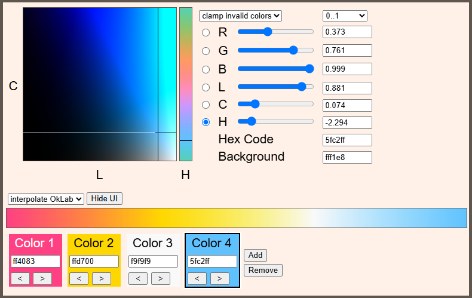

# ris_color_picker

Single file HTML color picker using [Oklab](https://en.wikipedia.org/wiki/Oklab_color_space), a [perceptual color space](https://bottosson.github.io/posts/oklab/) invented by Björn Ottosson.

Besides RGB (red, green, blue), this color picker also exposes LCH:

- **L**uminocity: How bright the color is.  
  Goes from black to white.
- **C**hroma: How strong or saturated the color is.  
  Goes from colorless, grey, to colorful.
- **H**ue: The actual color value.

LCH is the polar form of Oklab. This means hue represents an angle and wraps around. The angle is in radians, which goes from negative PI to positive PI, or -3.141 to +3.141.

Note that Oklab is a larger color space than RGB. This means not every Oklab color can be represented as an RGB color. You can choose whether you want to clamp or hide invalid Oklab colors. In case of hiding, invalid colors will be drawn as magenta #ff00ff.

If you selected an invalid RGB color, it will be marked by this emoji: 🛑 Clicking on the emoji will clamp the color into valid range.

## Links

See a fully embedded, working version on my website: https://www.rismosch.com/article?id=color-picker
